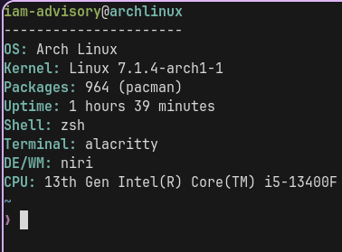

# hellos - A lightweight system information fetch written in C.

## Installation
```bash
git clone https://github.com/iamadvisory/hellos.git
cd hellos
sudo make install
```

## Usage
```bash
hellos
```


