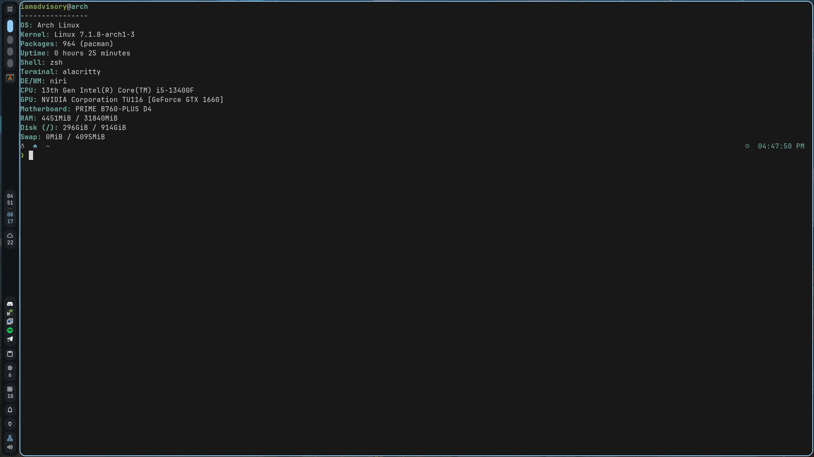

# hellos v0.8 - A lightweight system information fetch written in C.

## Installation

### Using Make
**Dependencies:** `clang`, `make`

```bash
git clone https://github.com/iamadvisory/hellos.git
cd hellos
sudo make install
```

## Usage
```bash
hellos
```



# NOT AI PROJECT
